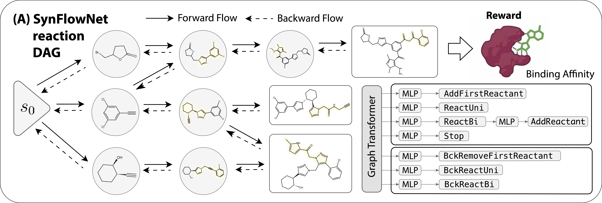

[](https://arxiv.org/abs/2405.01155)
[](https://www.python.org/downloads/)
[](LICENSE)


# SynFlowNet - Towards molecule design with garentueed synthesis pathways

Official implementation of SynFlowNet, a GFlowNet model with a synthesis action space, by Miruna Cretu, Charles Harris, Julien Roy, Emmanuel Bengio and Pietro Liò.

SynFlowNet learns how to generate molecules from chemical reactions and available building blocks. We implemented a new Environment, which defines an MDP which starts from an empty graph, followed by an Enamine building block. Stepping forward in the environment consists in running a reaction using RDKit. This repo contains a specific categorical distribution type for SynFlowNet actions, `ActionCategorical`, and a `GraphTransfomerReactionsGFN` class for a model which outputs an `ActionCategorical`. This project builds upon the code provided by [recursionpharma/gflownet](https://github.com/recursionpharma/gflownet), available under the [MIT](https://github.com/recursionpharma/gflownet/blob/trunk/LICENSE) license. For a primer and repo overview visit [recursionpharma/gflownet](https://github.com/recursionpharma/gflownet).



## Installation

### PIP

This package is installable as a PIP package, but since it depends on some torch-geometric package wheels, the `--find-links` arguments must be specified as well:

```bash
pip install -e . --find-links https://data.pyg.org/whl/torch-2.1.2+cu121.html
```
Or for CPU use:

```bash
pip install -e . --find-links https://data.pyg.org/whl/torch-2.1.2+cpu.html
```

## Reproducing results

### Data

The training relies on two data sources: modified _Hartenfeller-Button_ reaction templates and Enamine building blocks. The building blocks are not freely available and can be obtained upon request from [enamine.net/building-blocks/building-blocks-catalog](https://enamine.net/building-blocks/building-blocks-catalog). We used the "Global stock" data and selected 6000 random molecules from here to train the model. After pre-processing the building blocks files using the scripts in `src/gflownet/data/building_blocks`, make sure that the file names match those in `src/gflownet/tasks/config.py`.

### Training

The model can be trained using the sEH binding affinity proxy as reward by running `src/gflownet/tasks/seh_reactions.py`. You may want to change the default configuration in `main()`. The reward proxy is imported from `src/gflownet/models/bengio2021flow.py`.


# Citation

If you use this code in your research, please cite the following paper:

```
@article{cretu2024synflownet,
      title={SynFlowNet: Towards Molecule Design with Guaranteed Synthesis Pathways},
      author={Miruna Cretu and Charles Harris and Julien Roy and Emmanuel Bengio and Pietro Liò},
      journal={arXiv preprint arXiv},
      year={2024}
}
```
